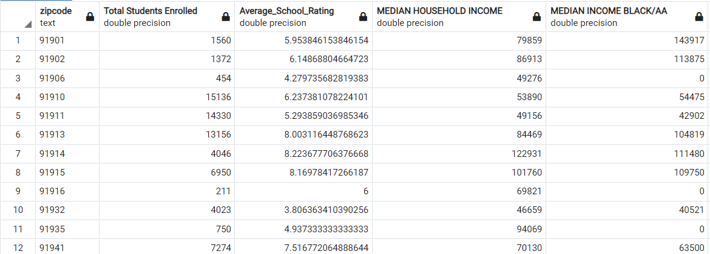
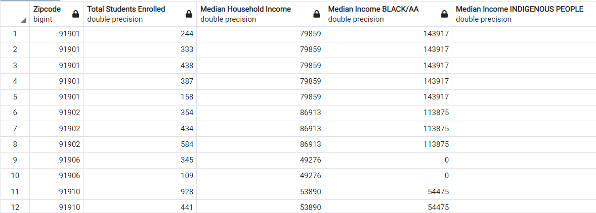

# PROJECT 4: MACHINE LEARNING - SCHOOL RATING PREDICTION MODEL

## Team Members:
* Parth Korat
* Geoff Pawlowski
* Amelia Corea
* Ashutosh Sawant

## Backgound
This project is the logical next step based on the Project 3 that was created by Team Bulldog. The link for the project is https://github.com/pkorat/San-Diego-County-Education-Equity-Analysis. In this project we had collected data from various sources and tried to analyze whether the Public Education System serve all Residents in San Diego County Equally?

For this project we are utilizing the data we collected during Project 3 and using the concepts of Machine Learning, we are trying to create a predition model which will help analyze the School Rating in a particular area based on the social-economical parameter

## Tech Used:
* AWS RDS
* PostgreSQL
* Python Plotly
* Python PANDAS
* Scikit-learn

## Input
Following sources to collect our input data:

  

## Database
AWS Cloud Database (PostgreSQL) was used to store our data features before being utilized by the model. Two new database tables were created for the project:
* `sd_master_df`

* The table provided information that was aggregated on Zipcode and has important data parameters on the Zipcode's population, median income, average school rating, crime statistics etc. This table was not used for for ML analysis of the data features.

* `ml_master_clean`

* The table provided information on individual Schools and students in the San Diego County and also has important data parameters on the Zipcode's population, median income,  crime statistics etc. This table was used heavily for prediction.
