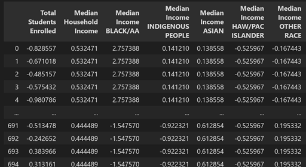
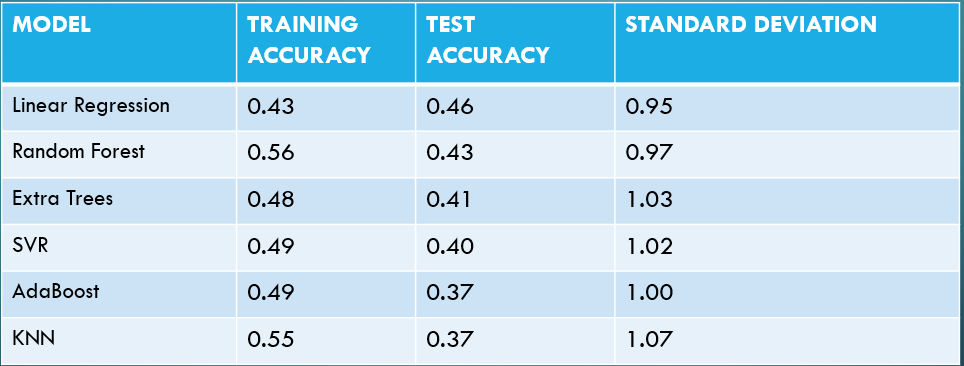

# PROJECT 4: MACHINE LEARNING - SCHOOL RATING PREDICTION MODEL

## Team Members:
* Parth Korat
* Geoff Pawlowski
* Amelia Corea
* Ashutosh Sawant

## Backgound
This project is the logical next step based on the Project 3 that was created by Team Bulldog. The link for the project is https://github.com/pkorat/San-Diego-County-Education-Equity-Analysis. In this project we had collected data from various sources and tried to analyze whether the Public Education System serve all Residents in San Diego County Equally?

For this project we are utilizing the data we collected during Project 3 and using the concepts of Machine Learning, we are trying to create a predition model which will help analyze the School Rating in a particular area based on the social-economical parameter

## Tech Used:
* AWS RDS
* PostgreSQL
* Python Plotly
* Python PANDAS
* Scikit-learn
* Tableau

    

## Input
Following sources were used to collect our input data:

  

## Database
AWS Cloud Database (PostgreSQL) was used to store our data features before being utilized by the model. 
* remote_db_endpoint = 'bulldogs-3.cznzpremohjj.us-east-2.rds.amazonaws.com'
* remote_db_port = '5432'
* remote_db_name = 'Bulldogs'

Two new database tables were created for the project:
* `sd_master_df`

* The table provided information that was aggregated on Zipcode and has important data parameters on the Zipcode's population, median income, average school rating, crime statistics etc. This table was not used for for ML analysis of the data features.

* `ml_master_clean`

* The table provided information on individual Schools and students in the San Diego County and also has important data parameters on the Zipcode's population, median income,  crime statistics etc. This table was used heavily for prediction.

## Data Cleansing
The table `ml_master_clean` had more than 50 columns i.e. features for the prediction analysis to start. However before the data could be used we performed some data cleaning activities. Some of the data cleaning activities done are as follows:
* Four New Columns for Crime ratios are created which will standardize the count with the Zipcode population. The new columns created are 'Theft Count Ratio', 'Substance Abuse Count Ratio', 'Violent Count Ratio' and 'Miscellaneous Count Ratio'
* Removing the Crime Actual Counts from the dataframe i.e. Theft Count, Substance Abuse Count, Violent Count and Miscellaneous Count
* Removing columns which might not be critical like latitude, longitude, School address, City and Grades

## Dataset Composition
* 696 Individual Schools
* 50 Features
* Feature Categories
  * Median Income by Ethnicity at Zipcode Level
  * Family Structure at Zipcode Level
  * Educational Attainment Levels at Zipcode Level
  * Number of Students at School
  * Crime Rates per Population at Zipcode Level
  * Population Type by Ethnicity at Zipcode Level
* Target – School Rating 1- 10

## Machine Learning Models Used

## Tableau Analysis Link: https://public.tableau.com/app/profile/geoffrey.pawlowski/viz/SDCountySchoolRatingDatavsUSCensusDemographicData/ViolentCrimevsSchoolRating

# CONCLUSION

* We created several models that can predict a schools performance rating +/- 1 point ~66% of the time, using just demographic data. 
* This should make us question how our education dollars and programs are being spent and administered.  
* This should also make us study outliers to our models to see where “breakaway schools are achieving better outcomes than the demographics would suggest.   

